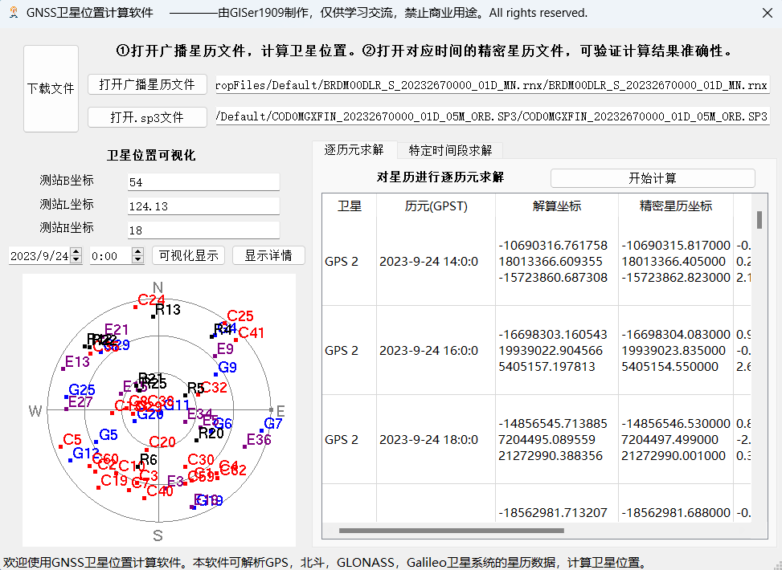
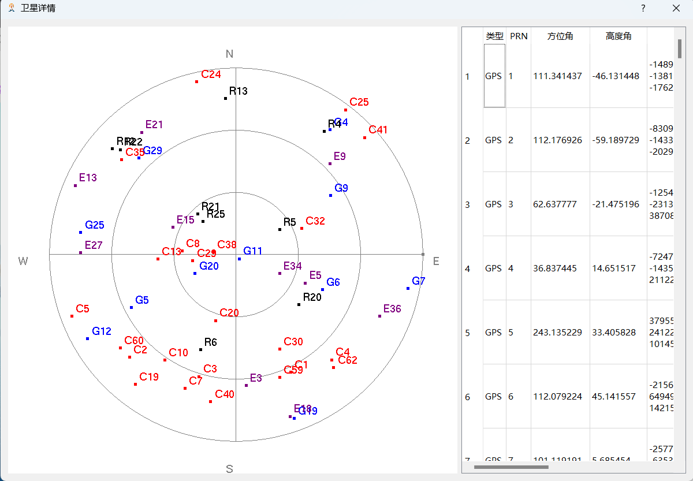

# SatellitePositionExe
Software for finding Satellite position according to broadcast Ephemeris

The functions are as follows:

- Open broadcast ephemeris files and calculate satellite positions for each epoch. By using Chebyshev polynomials and indirect adjustment methods (using fourth-order Runge-Kutta method for GLONASS satellites), satellite positions can be calculated for any specific time or time interval. Additionally, it is possible to set the geocentric coordinates and visualize the satellite azimuth.

- Open precise ephemeris files for the corresponding time to verify the accuracy of the calculated results.

The software running interface is as follows:

 

#### [Download the executable file (.exe)](https://github.com/GISer1909/SatellitePosition/releases/download/v2.0/GNSS._v2.0.rar) from the repository's release version to experience the functionality.
